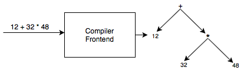

# LexPar

LexPar is a tool to generate compiler frontends. A compiler frontend is an executable that takes in a string
and returns a directed acyclic graph (DAG) representation of it.



The regular expressions and the grammar are specified using a JSON file. As an overview to the process, let's
write an example configuration. Later, we will cover the details of notation to write regular expressions,
grammar and syntax directed definitions.

## Example: Positive integer addition
Suppose we want to parse strings that depict addition of positive integers. Some examples are:

```
12 + 34
13 + 123 + 23
23
```

We need two regular expressions, one for positive integers and one for `+`.
```
number: (0|1|2|3|4|6|7|8|9)(0|1|2|3|4|6|7|8|9)*
+: +
```
On the left are the names of regular expressions and on the right are the regular expression themselves. The regular expression names become token types which in turn become grammar terminals.

The context free grammar to parse these strings look like these.
```
Start symbol: expr'

Productions:
expr' -> expr
expr -> expr + number
expr -> number
```
Here, `expr'` and `expr` are non terminals and `+` and `number` are terminals.

The JSON configuration would look like this.

```json
{
    "regularExpressions": {
        "number": "(0|1|2|3|4|6|7|8|9)(0|1|2|3|4|6|7|8|9)*",
        "+": "+"
    },
    "grammar": {
        "start": "expr'",
        "productions": [
            {
                "head": "expr'",
                "body": ["expr"]
            },
            {
                "head": "expr",
                "body": ["expr", "+", "number"],
            },
            {
                "head": "expr",
                "body": ["number"]
            }
        ]
    }
}
```
The syntax directed definitions (SDDs) notation is designed to generate a DAG. Here's the configuration again with
the SDD rules.

```json
{
    "regularExpressions": {
        "number": "(0|1|2|3|4|6|7|8|9)(0|1|2|3|4|6|7|8|9)*",
        "+": "+"
    },
    "grammar": {
        "start": "expr'",
        "productions": [
            {
                "head": "expr'",
                "body": ["expr"],
                "rule": {
                    "type": "copy",
                    "rootLabel": "",
                    "children": [0]
                }
            },
            {
                "head": "expr",
                "body": ["expr", "+", "number"],
                "rule": {
                    "type": "tree",
                    "rootLabel": "+",
                    "children": [0, 2]
                }
            },
            {
                "head": "expr",
                "body": ["number"],
                "rule": {
                    "type": "copy",
                    "rootLabel": "",
                    "children": [0]
                }
            }
        ]
    }
}
```

Let's move on to notation details

## Regular expression notation
The regular expressions have three operators
1. Union, which is written as `|` operator.
2. Concatenation, which is expressed by writing two operands one after another without any punctuation.
3. Kleene star, which is written as `*` operator.

The operators are grouped using parenthesis `(` and `)`.

If you want to use any of the above symbols in a regular expression, you need to escape it. The escape
operator is `/`. So the regular expression for recognising `*` would be `/*`. To escape `/` itself, write
`//`.

## Grammar notation
The grammars are written in Backus-Naur form. It contains a "start" property for start symbol of the grammar
and a "productions" for a list of productions.

The production consist of a `head` and a `body`. The `head` is a string and the `body` is an array of strings.
The terminals of grammar must match regular expression names.

Each production has a `rule` property which contain SDD rules to generate a DAG. There are two types of rules.
1. "tree" rule where we specify the root label and the indices of children of the node in production body.
2. "copy" rule where we specify the index in production body of whose attributes we want to copy up.

The common case of copying the first child up can be omitted. The above configuration would look like this.

```json
{
    "regularExpressions": {
        "number": "(0|1|2|3|4|6|7|8|9)(0|1|2|3|4|6|7|8|9)*",
        "+": "+"
    },
    "grammar": {
        "start": "expr'",
        "productions": [
            {
                "head": "expr'",
                "body": ["expr"],
            },
            {
                "head": "expr",
                "body": ["expr", "+", "number"],
                "rule": {
                    "type": "tree",
                    "rootLabel": "+",
                    "children": [0, 2]
                }
            },
            {
                "head": "expr",
                "body": ["number"],
            }
        ]
    }
}
```
Along with this directory is an `example.json` which serves as a starting point for your own configurations.